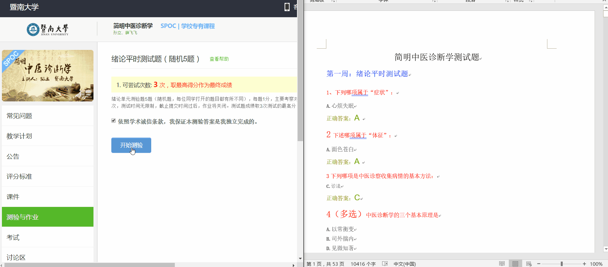

# 中国慕课网自动化工具

## 环境
- python 3.6
- 在项目目录使用
```pip install -r requirments.txt```
- ChinaMooc.py 仅限于Chrome浏览器，且需要配置chromedriver.exe

## ChinaMooc.py
- 自动化看视频
- 自动看文档(解决了chrome禁用flash的问题, 但文档可能不能自动看了)
- 自动看富文本

## Assistnt.py
word文档查找助手

- 帮助你做题
- **可能不支持wps**


#### Assistant 使用方法及演示使用
- 配置好环境后，双击运行`Assistant.py`，程序即会打开题库
- 按 `win` + `→` 将题库word文档分屏至右侧， 浏览器分屏至左侧
- 选中题目文字，按 `ctrl` + `c`， 题库将会自动跳转到该题目(**极少数情况存在没有的题目**)



